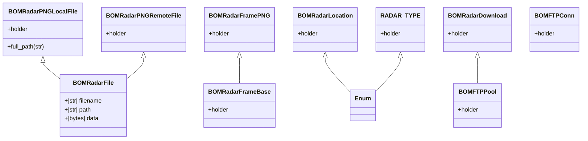

- [Class Diagrams](#class-diagrams)
- [Modules](#modules)
  - [radar](#radar)
    - [download.py](#downloadpy)
      - [BOMRadarDownload](#bomradardownload)
  - [radar.common](#radarcommon)
    - [constants.py](#constantspy)
      - [Credential Constants](#credential-constants)
      - [IDRXX\_DATA](#idrxx_data)
    - [frame\_base.py](#frame_basepy)
      - [BOMRadarFrameBase](#bomradarframebase)
    - [frame\_png.py](#frame_pngpy)
      - [BOMRadarFramePNG](#bomradarframepng)
    - [location.py](#locationpy)
      - [BOMRadarLocation](#bomradarlocation)
    - [types.py](#typespy)
      - [RADAR\_TYPE](#radar_type)
      - [RADAR\_TYPE\_MAP](#radar_type_map)
    - [utils.py](#utilspy)
      - [get\_translation\_coordinate](#get_translation_coordinate)
      - [split\_filename](#split_filename)
  - [radar.common.file\_handling](#radarcommonfile_handling)
    - [base.py](#basepy)
      - [BOMRadarFile](#bomradarfile)
    - [local.py](#localpy)
      - [BOMRadarPNGLocalFile](#bomradarpnglocalfile)
    - [remote.py](#remotepy)
      - [BOMRadarPNGRemoteFile](#bomradarpngremotefile)
  - [radar.remote](#radarremote)
    - [conn.py](#connpy)
      - [BOMFTPConn](#bomftpconn)
    - [pool.py](#poolpy)
      - [BOMFTPPool](#bomftppool)

# Class Diagrams

# Modules

## radar

### download.py

#### BOMRadarDownload

## radar.common

### constants.py

#### Credential Constants

#### IDRXX_DATA

### frame_base.py

#### BOMRadarFrameBase

### frame_png.py

#### BOMRadarFramePNG

### location.py

#### BOMRadarLocation

### types.py

#### RADAR_TYPE

#### RADAR_TYPE_MAP

### utils.py

#### get_translation_coordinate

#### split_filename

## radar.common.file_handling

### base.py

#### BOMRadarFile

### local.py

#### BOMRadarPNGLocalFile

### remote.py

#### BOMRadarPNGRemoteFile

## radar.remote

### conn.py

#### BOMFTPConn

### pool.py

#### BOMFTPPool
